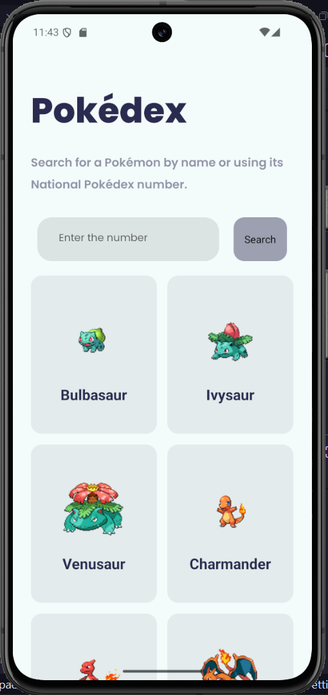
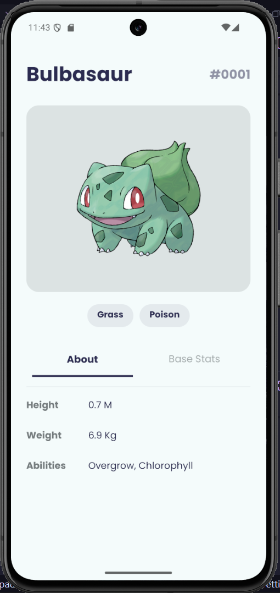
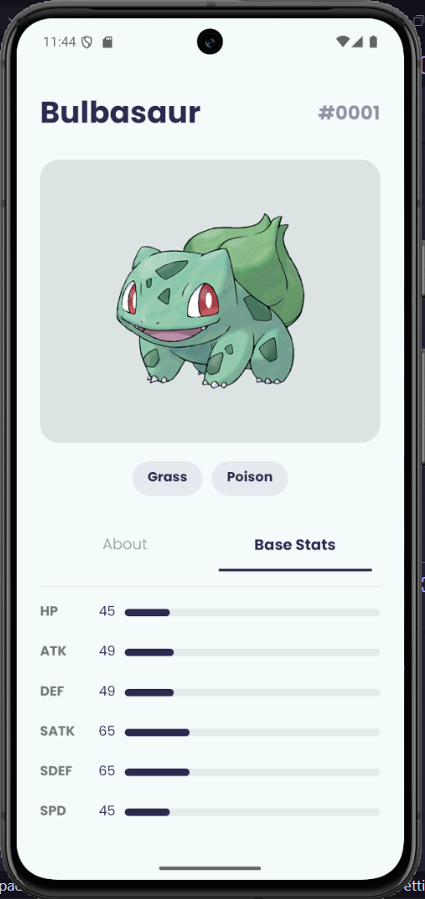

<div align="center">

# Pokédex App 📱

A clean, minimal Pokédex built with React Native and Expo — browse the entire Pokémon roster, load as many as you want, and deep dive into stats, types, and abilities for any Pokémon.

[](https://reactnative.dev/)
[](https://expo.dev/)
[](https://www.typescriptlang.org/)
[](https://pokeapi.co/)

</div>

---

## Screenshots

> _Add screenshots here_

|      Home Screen       |      Pokémon Detail      |        Base Stats        |
| :--------------------: | :----------------------: | :----------------------: |
|  |  |  |

---

## Features

- **Browse Pokémon** — loads 10 Pokémon on launch in a clean 2-column grid
- **Custom Load** — enter any number to fetch exactly that many Pokémon at once
- **Detail View** — tap any card to see full details: official artwork, Pokédex ID, type badges
- **About Tab** — height, weight, and abilities for every Pokémon
- **Base Stats Tab** — HP, ATK, DEF, SATK, SDEF, SPD with animated progress bars
- **Pokédex-style ID** — formatted as `#0001` just like the real thing
- **TypeScript throughout** — fully typed API responses and component props

---

## Tech Stack

| Layer      | Tech                                         |
| ---------- | -------------------------------------------- |
| Framework  | React Native + Expo                          |
| Navigation | Expo Router (file-based)                     |
| Language   | TypeScript                                   |
| Data       | [PokeAPI](https://pokeapi.co/)               |
| Fonts      | Poppins (Regular, SemiBold, Bold, ExtraBold) |
| Styling    | React Native StyleSheet + custom theme       |

---

## Project Structure

```
app/
├── index.tsx              # Home screen — Pokémon grid list
└── pokemon/
    └── [id]/
        └── index.tsx      # Detail screen — stats, types, abilities

theme/
└── index.ts               # Color palette & design tokens
```

---

## Getting Started

### Prerequisites

- Node.js 18+
- Expo CLI (`npm install -g expo-cli`)
- Expo Go app on your phone (or an Android/iOS emulator)

### Installation

```bash
# Clone the repo
git clone https://github.com/Ayush-7275/Pokedex-App.git
cd Pokedex-App

# Install dependencies
npm install

# Start the dev server
npx expo start
```

Scan the QR code with Expo Go on your phone, or press `a` for Android emulator / `i` for iOS simulator.

---

## API Reference

This app uses the free [PokéAPI](https://pokeapi.co/) — no API key required.

| Endpoint                 | Usage                                   |
| ------------------------ | --------------------------------------- |
| `GET /pokemon?limit={n}` | Fetch list of N Pokémon                 |
| `GET /pokemon/{name}`    | Fetch full details for a single Pokémon |

Sprite images are sourced from the [PokeAPI sprites repo](https://github.com/PokeAPI/sprites) on GitHub.

---

## Roadmap

- [ ] Search by Pokémon name
- [ ] Type-based color theming per Pokémon
- [ ] Evolution chain tab
- [ ] Offline caching with AsyncStorage
- [ ] Shiny sprite toggle

---

## Author

**Ayushman** · [@Ayush-7275](https://github.com/Ayush-7275)

Built with PokeAPI and a lot of nostalgia.
